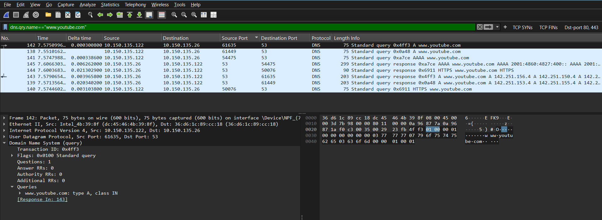
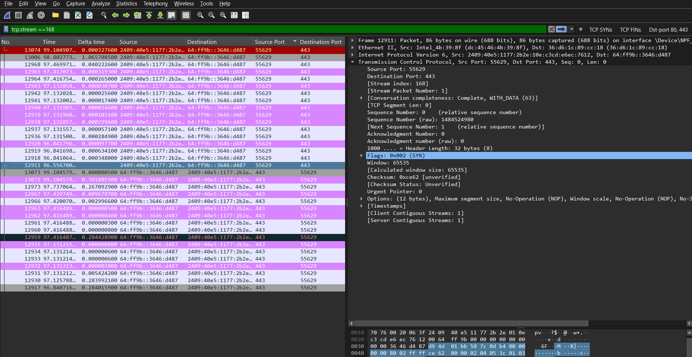
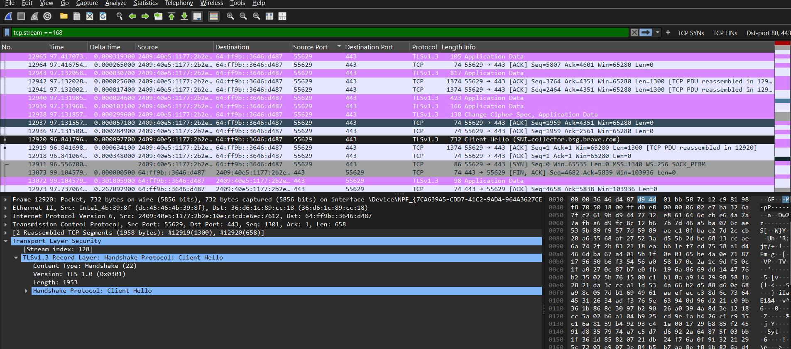
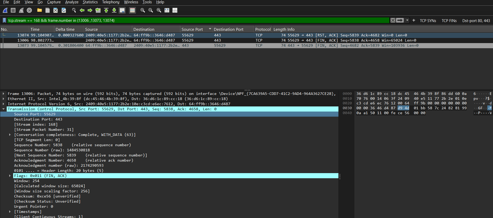

# Wireshark Network Traffic Analysis 

## Overview
This project documents my hands-on analysis of network traffic using Wireshark.
The objective was to understand what happens at the packet level when a user accesses a website through a web browser.
I captured live network traffic and analyzed DNS resolution, TCP communication, and encrypted HTTPS/TLS traffic.

## Tools & Environment

- Wireshark
- Windows 11
- Web browser
- Wi-Fi network

## Scenario
Wireshark was started on the active Wi-Fi interface before accessing websites through the browser.
The generated traffic was then filtered and analyzed to understand the different stages of network communication.

---

# 1. DNS Resolution Analysis
## Objective
The purpose of this section was to understand how a domain name is resolved into an IP address before communication with the destination server begins.
## Filter Used
'dns'
  
To isolate a particular domain, I also used:

`dns.qry.name eq "www.youtube.com"`
## Observation
The client sent a DNS query to the configured DNS resolver requesting information about `www.youtube.com`.
A DNS response was then received containing IP addresses associated with the requested domain.
## Packet Details

- Client IP: `10.150.135.122`
- DNS Server IP: `10.150.135.26`
- DNS Server Port: `53`
- Transport Protocol: `UDP`
- Requested Domain: `www.youtube.com`
- Query Type: `A`
- Response: Multiple IPv4 addresses were returned
## Analysis

The capture shows that the client did not need to know the web server's IP address beforehand.

Instead, it sent a DNS query to its DNS resolver. The resolver returned IP addresses associated with `www.youtube.com`, which could then be used for further communication.

The DNS request was transported using UDP. The client used a temporary source port while the DNS server received the request on its standard port 53.

The response reversed these ports and was sent back to the client.

## Evidence

---
# 2. TCP Connection Analysis
## Objective

The purpose of this section was to examine how a TCP connection is established between a client and server.
## Filters used
'tcp'

To identify connection attempts:

`tcp.flags.syn == 1`

After selecting a relevant connection, I isolated its TCP stream using:

`tcp.stream == 7`
## Observation

A TCP connection was established using the TCP three-way handshake.
The packets showed the following sequence:

1. SYN
2. SYN, ACK
3. ACK

## Connection Flow

Client:

`Client-IP:Temporary-Port`
'

Server:

`Server-IP:443`

The communication occurred as:

`Client → Server : SYN`

`Server → Client : SYN, ACK`

`Client → Server : ACK`

## Analysis

The first SYN packet indicates that the client requested a TCP connection with the server.

The server responded with SYN, ACK, indicating that it accepted the request and acknowledged the client's SYN.

The client then returned an ACK, completing the TCP three-way handshake.

After this process, the TCP connection was established and application-layer communication could take place.

Port 443 on the server indicates that the connection was intended for HTTPS communication.

## TCP Stream

Wireshark assigned this conversation a TCP stream number/index.

I used:

`tcp.stream == 7`

to isolate packets belonging only to this particular TCP connection.

This made it easier to analyze the connection without unrelated TCP packets from other simultaneous network activity.

## Evidence

---

# 3. TLS / HTTPS Analysis

## Objective

The purpose of this section was to observe how encrypted HTTPS communication appears in a packet capture.
## Filter Used

`tls`

## Observation

After the network connection was established, TLS traffic was observed between the client and server.

HTTPS uses TLS to protect the application data exchanged between the browser and the server.

## Analysis

Unlike unencrypted HTTP traffic, the actual application data transmitted through HTTPS is encrypted.

## Evidence

---

# 4. TCP Connection Termination

## Objective

The purpose of this section was to observe how an established TCP connection can be closed.

## Observation

Packets containing TCP FIN and ACK flags were observed in the capture.
## Analysis

The FIN flag indicates that one endpoint has finished sending data and wants to close its side of the TCP connection.

ACK is used to acknowledge received TCP information.

## Evidence

---

# Key Wireshark Filters Used

| Purpose | Filter |
|---|---|
| DNS traffic | `dns` |
| Specific DNS query | `dns.qry.name == "www.youtube.com"` |
| TCP traffic | `tcp` |
| TCP SYN packets | `tcp.flags.syn == 1` |
| Specific TCP conversation | `tcp.stream == 7` |
| TLS traffic | `tls` |

---

# Key Findings

Through this packet analysis, I observed several stages involved in normal web communication:

1. DNS was used to resolve a domain name into IP addresses.
2. DNS queries in the analyzed example were transported using UDP and sent to port 53.
3. TCP connections could be isolated into individual streams in Wireshark.
4. TCP used the SYN → SYN/ACK → ACK process to establish a connection and because of these three flags used it is known as three-way-handshake.
5. HTTPS communication used port 443 and TLS to protect application data.
6. TCP FIN/ACK packets could be observed when established connections were being terminated.

# What I Learned

This project helped me move beyond simply capturing packets and understand how different protocols work together during normal network communication.

I learned how to isolate relevant traffic from a large packet capture, follow individual TCP conversations, analyze DNS queries and responses, identify TCP connection establishment, and observe encrypted TLS traffic.

This exercise also demonstrated that a single browsing session can generate many simultaneous network conversations, so packet analysis requires filtering and isolating the traffic relevant to the investigation.

